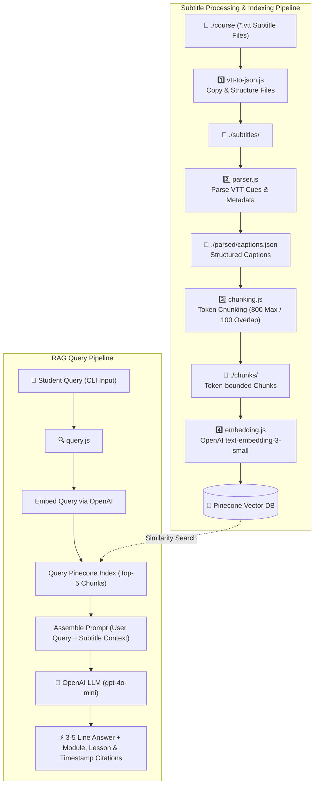

# 🎓 CourseHelp — AI-Powered Video Course RAG System

An intelligent Retrieval-Augmented Generation (RAG) assistant that indexes video course subtitle files (`.vtt`), performs semantic vector searches, and answers student questions with concise explanations accompanied by exact **Module**, **Chapter/Lesson**, and **Video Timestamps**.

---

## 🛠️ Tech Stack

* **Runtime & Language**: Node.js (ES Modules)
* **LLM Model**: OpenAI `gpt-4o-mini` (Streaming completions)
* **Embedding Model**: OpenAI `text-embedding-3-small` (1024 dimensions)
* **Vector Database**: Pinecone Vector DB (`@pinecone-database/pinecone`)
* **Tokenizer**: `js-tiktoken` (Sliding-window token counting)
* **Subtitle Parsing**: `node-webvtt` (WebVTT parsing)
* **CLI Interaction**: Native `node:readline` module
* **Environment Configuration**: `dotenv`

---

## 🏗️ Architecture & System Design

The system operates across two main pipelines: **The Indexing Pipeline** and **The RAG Query Pipeline**.

### 📊 System Architecture Flowchart



---

### 📑 Detailed Component Explanation

#### 1. Indexing Pipeline (`src/indexing/`)
1. **`vtt-to-json.js`**: Traverses the input `./course/` directory recursively to locate WebVTT (`.vtt`) files and copy them into `./subtitles/` while retaining folder structures.
2. **`parser.js`**: Uses `node-webvtt` to extract start/end cue times, clean formatting, calculate token counts, and extract hierarchy (`course`, `module`, `lesson`). Outputs master `captions.json`.
3. **`chunking.js`**: Uses `js-tiktoken` to build sliding-window chunks with a **800 token maximum limit** and a **100 token overlap** between consecutive chunks to preserve contextual continuity across cue boundaries.
4. **`embedding.js`**: Generates 1024-dimensional embeddings for each chunk via OpenAI's `text-embedding-3-small` in batches of 100 and upserts vectors into Pinecone alongside complete metadata (text, timestamps, module, and lesson details).

#### 2. Query Pipeline (`src/user-query/`)
1. **`query.js`**:
   * Prompts the student interactively via a CLI readline loop.
   * Embeds the student's question into vector space.
   * Performs vector similarity search against Pinecone to retrieve the top 5 most relevant course transcript chunks.
   * Constructs a contextual prompt for `gpt-4o-mini`.
   * Streams a concise **3–5 line answer** followed by a structured **Source Reference** section specifying the **Module**, **Chapter/Lesson**, and **Timestamps**.

---

## ⚡ Installation & Setup Guide

### Prerequisites
* [Node.js](https://nodejs.org/) (v18 or higher)
* OpenAI API Key
* Pinecone API Key & Index

---

### Step 1: Clone Repository & Install Dependencies

```bash
git clone <repository-url>
cd courseHelp
npm install
```

---

### Step 2: Environment Configuration

Create a `.env` file in the root directory:

```env
OPENAI_API_KEY=your_openai_api_key_here
PINECONE_API_KEY=your_pinecone_api_key_here
PINECONE_INDEX=your_pinecone_index_name_here
```

---

### Step 3: Add Course Subtitles

Place your WebVTT subtitle files (`.vtt`) inside the `./course` directory organized by module and lesson folders:

```text
course/
└── class-subtitle/
    └── module 1/
        └── lesson 1/
            └── video.vtt
```

---

### Step 4: Run the Indexing Pipeline

Execute the indexing steps sequentially:

```bash
# 1. Copy subtitles
node src/indexing/vtt-to-json.js

# 2. Parse VTT into JSON & metadata
node src/indexing/parser.js

# 3. Create token chunks with overlap
node src/indexing/chunking.js

# 4. Generate embeddings and upload to Pinecone
node src/indexing/embedding.js
```

---

### Step 5: Start the Query CLI

Launch the interactive RAG query assistant:

```bash
npm run query
```

#### Example Usage:
```text
=========================================
 🎓 Course AI Assistant (RAG Query CLI) 
 Type your question below or 'exit' to quit.
=========================================

❓ Ask a question: How do we set up routing in Expo?

🔍 Embedding query and searching vector store...

📌 Found 5 relevant context chunks:
   [1] 02-file-based-routing (00:01:15.000) - Score: 87.4%
   [2] 01-introduction (00:05:22.000) - Score: 78.2%

🤖 Assistant: 
Expo Router uses file-based routing where every file added to the `app` directory automatically becomes a navigation route.
You define layouts using `_layout.js` files to wrap nested pages in stacks or tab bars.
Navigation between screens is handled using the `<Link />` component or the `router.push()` helper function.

📍 Source Reference:
- **Module**: module 1
- **Chapter/Lesson**: 02-file-based-routing
- **Timestamp**: 00:01:15.000 - 00:04:30.000
```
